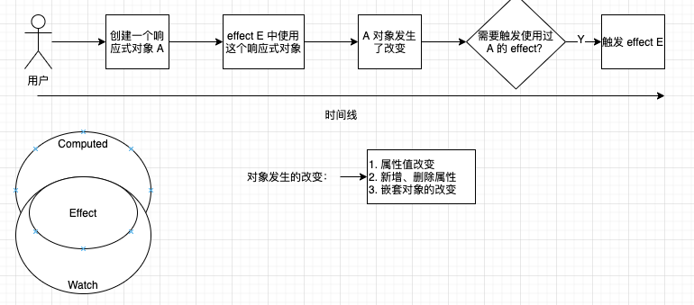

# reactivity 项目介绍
在学习 [Vue-Next](https://github.com/vuejs/vue-next) 中响应式系统部分时，心里就在想：
- 响应式系统的原理是什么？
- 响应式系统能拿来做什么？
- 考虑兼容性的响应式系统又该怎么实现？

抱着学习这些问题的心态，学习了一下 packages/reactivity 这个包，然后加上自己的一些理解，完成了这个响应式的包：https://github.com/Tzxhy/reactivity .

本文将分为如下几段，来讲解本人在完成响应式系统的过程中遇到的问题，以及一些心得。
1. [响应式基本原理](#基本原理) 讲解响应式系统的原理，以及能够做什么；
2. [依赖收集](#依赖收集) 讲解依赖收集的过程；
3. [计算属性、监听器](#计算属性) 讲解计算属性（computed）、 监听（watch）的实现；
5. [响应式代理](#底层代理) 讲解响应式代理的接口及实现。

下文会主要说关键的步骤，会忽略对相关辅助函数的说明。在文末的[函数附录](#函数签名及说明)中会贴出所有函数的签名及作用。 `同时如果有读者有兴趣一起研究，可以加我好友（微信号：tanzhixuan_swjtu），一起学习，一起进步~`。

## 基本原理


上图是一个基本原理。上面有时间线的图例应该是比较好理解的，这里不多说；左下角的包含关系，说明当前实现中， `computed` 和 `watch` 都是基于 `effect` 实现的；中间是对 `对象发生改变` 的一个简单定义。

我们开始直接从入口函数来探索：
```ts
export function reactive<T extends object>(target: T, hooks?: ReactiveHooks): T {
    // 不可监听，比如本身是个基本类型。（这种基本类型可以用 ref）
    if (!canObservable(target)) {
        return target;
    }
    // 本身已经是响应式，直接返回
    if (isReactive(target)) return target;

    // 被手动标记了不处理，直接返回
    if ((target as Record<any, any>)[ReactiveFlags.SKIP]) {
        return target;
    }

    // 原始对象包含 key [ReactiveFlags.REACTIVE]，说明该对象被已被处理过，可以直接返回这个 key。
    // 这个跟上面的  '本身已经是响应式，直接返回'  不同。
    if ((target as Record<any, any>)[ReactiveFlags.REACTIVE]) {
        return (target as Record<any, any>)[ReactiveFlags.REACTIVE];
    }

    if ((target as Record<any, any>)[ReactiveFlags.IS_COMPUTED]) return target;

    // 使用代理选择器创建一个代理对象。`ProxyChooser` 这个我们后面细说。
    const _proxy = ProxyChooser(target, hooks);
    
    // 给原始对象打个标志，防止重复创建响应式对象。也是上面的判断的依据。
    def(target, ReactiveFlags.REACTIVE, {
        configurable: true,
        value: _proxy,
    });
    // 给对象打一个 ID 标志，用于开发时排错。
    if (!(target as any)[ReactiveFlags.ID]) {
        const v = Math.random().toString(32).slice(2);
        def(target, ReactiveFlags.ID, {
            configurable: false,
            enumerable: false,
            get() {
                return v;
            },
        });
    }
    return _proxy;
}
```

这个入口很简单，除去一些必要的检查，就只有 `ProxyChooser` 一个比较重要的了。

```ts
// Define a proxy adapter for intercept the operation of data.

import ProxyUse from './proxy-choose/proxy';
import DefineUse from './proxy-choose/defineProperty';
import { ReactiveHooks } from './reactive';


export interface ProxyAdapter<T> {
    (target: T, hooks?: ReactiveHooks): T;
    [k: string]: any;
}

let ProxyChooser: ProxyAdapter<any>;
if (typeof Proxy === 'function') {
    ProxyChooser = ProxyUse;
} else {
    ProxyChooser = DefineUse;
}

function changeProxy(m: ProxyAdapter<any>) {
    ProxyChooser = m;
}

export {
    ProxyChooser,
    changeProxy,
};
```
可以看到 `ProxyChooser` 就是一个代理器选择器：支持 `Proxy` 就使用 `ProxyUse`；否则使用 `DefineUse`。ProxyUse 就是基于 Proxy Api 构建的底层监听；DefineUse 是基于 Object.defineProperty 构建的。这一块的内容会在 [底层代理](#底层代理) 一部分详细介绍。

这里，先暂时忽略监听器的实现，我们看看如何收集依赖。

## 依赖收集
先拿个例子来介绍什么是依赖收集：
```js
    const a = reactive({num: 0});
    const b = reactive({num: 0});
    const c = reactive({num: 0});
    effect(() => {
        // effect 1
        c.num = b.num;
    })
    effect(() => {
        // effect 2
        b.num = a.num;
    });
    expect(c.num).toBe(0);
    // 然后我们改变 a.num 为 10 后：
    a.num = 10;
    expect(c.num).toBe(10);
```
a/b/c 三个变量是用我们上一节讲的 reactive 函数生成的 `监控对象` 。接下来是两个 `effect` 语句：effect 1 中，依赖了 `b` 对象的 `num` 属性；effect 2 中，依赖了 `a` 对象的 `num` 属性。此时可以得到一个依赖关系：当 b.num `发生改变`（注意特地强调了下） 时，会调用 effect 1；同理 effect 2。因此当我们改变 a.num 时，会首先触发 effect 2，然后 b.num 被赋值，发生改变，触发 effect 1，然后 c.num 被赋值，找谁依赖了 c.num，发现没了，`expect(c.num).toBe(0);` 这个不是，必须在 effect 里的才会被收集依赖，毕竟这里只是一个语句，不是函数，也无法收集。有了这个简单的例子，大家应该对依赖收集有个简单的理解了。接下来我们深入 effect，看看怎么实现依赖收集。

```ts
// 依赖
const map: Map<object, Map<string, Set<EffectTarget>>> = new Map();

export let currentEffect: EffectTarget[] = [];
let shouldTrackFlag: boolean = true;
export function trackFree(fn: () => any) {
    shouldTrackFlag = false;
    const res = fn();
    shouldTrackFlag = true;
    return res;
}
export function pushTrack(effect: EffectTarget) {
    currentEffect.push(effect);
}
export function popTrack() {
    currentEffect.pop();
}

export function effect(fn: EffectTarget, _options?: EffectOptions) {
    pushTrack(fn);
    if (_options) {
        fn.schedule = _options.schedule;
    }
    fn();
    popTrack();
}
```
首先看 effect 函数：接收一个函数，我们叫它为 `EffectTarget`，还有一个可选的参数。在执行 fn 前，将 fn 入栈，然后处理options；再执行 fn，此时可能会访问到一些响应式对象的属性，在这个过程中，会触发到代理对象的 get 方法，比如 Proxy 的 get：
```ts
export function get<T>(target: any, key: string | symbol, receiver: any): T {

    // 一堆特殊 key 的判断
    // ...

    // 追踪当前的对象及 key
    track(target, key);
    
    // 对象 hooks 处理，略
    // ...

    let res = Reflect.get(target, key, receiver);

    // 响应式返回对象
    if (canObservable(res) && !res[ReactiveFlags.SKIP] && !isReactive(res)) {
        res = reactive(res);
    }
    return res;
}
```
可知，在 `fn` 的执行，我们首先入栈了当前的 EffectTarget，然后访问了响应式对象的 key，进入了 get 方法，然后调用 track 标记当前对象和 key 关联到 fn 上：
```ts
export function track<T extends object>(target: T, key: any) {

    if (!shouldTrackFlag || !currentEffect.length) return;
    let objDeps;
   
    // 找到当前对象和 key 对应的 EffectTarget 集合
    // ...

    // 添加 target:key -> EffectTarget 的映射
    currentEffect.slice(currentEffect.length - 1).forEach(i => {
        keyDeps.add(i);
    });

    // 处理 computed 的赃值，略
    // ...
}
```
在 fn 执行完成后，出栈 fn，完成一次 effect 注册。在每次执行 EffectTarget 时，也需要重新捕获依赖，防止依赖不全。

至此，讲解完了 effect 这一块内容。


## 计算属性
计算属性，本身也是 Vue 提出的概念：只在依赖改变的时候，才会计算一次。同样，来看个例子：
```js
    const value = reactive({ foo: 0 })
    const c1 = computed(() => {
        return value.foo;
    }, Symbol('c1'))
    const c2 = computed(() => {
        return c1.value + 1
    }, Symbol('c2'))
    expect(c2.value).toBe(1)
    expect(c1.value).toBe(0)
    value.foo = 10
    expect(c2.value).toBe(11)
    expect(c1.value).toBe(10)
```
c1/c2 一开始并不会执行，直到访问 c1.value、c2.value 时才会计算一次。当执行 `value.foo = 10` 时，会递归的找出相关依赖：c1 依赖 value.foo；c2 依赖 c1.value，会将这两个 effect 的赃值设为 true，表明下次访问.value 时，需要重新计算。

我们来看看 computed 的代码：
```ts

export interface Ref<T> {
    value: T;
    __id: any;
}
export function ref<T>(v: T, hooksOptions?: ReactiveHooks, ...id: any): Ref<T> {
    const o = {value: v} as Ref<T>;
    return reactive(o, hooksOptions);
}
export interface ReactiveHooks {
    onGet?: (target: any, key: KeyType) => void;
    onSet?: (target: any, key: KeyType, oldValue: any, newValue: any) => boolean | void;
}
export function computed<T>(fn: () => T, id?: any): Ref<T> {
    const _id = id || getId();
    let runner: any;
    let _hasInitEffect = false;
    let _setFlag: boolean = false;
    let _v: T;
    const update = () => {
        if (update.dirty) {
            _setFlag = true;
            const newValue = fn();
            if (newValue !== _v) {
                update.dirty = false;
                _v = _computedRef.value = newValue;
            }
            _setFlag = false;   
        }
    };
    update.dirty = true;
    update.__id = _id;
    // flag this effect is in computed mode
    update.computed = true;

    // flag this called in effect as least once.
    let _hasCalledInEffect = false;

    const _computedRef = ref<T>(undefined as unknown as T, {
        onGet(_target: any, _key: KeyType) {
            if (_target[ReactiveFlags.ID] !== _computedRef[ReactiveFlags.ID as keyof Ref<any>]) return;
            if (!update.dirty || _setFlag) {
                return;
            }
            if (!_hasCalledInEffect && shouldTrack.length && !currentEffect[0].computed) { // in a effect block
                _hasCalledInEffect = true;
            }

            if (_hasCalledInEffect || !_hasInitEffect) { // exec in effect, trigger should be ignored.
                _hasInitEffect = true;
                _effect(update, {
                    // when fn's deps changed, trigger a schedule.
                    schedule: (_runner: EffectTarget) => {
                        runner = _runner;
                        if (_hasCalledInEffect) {
                            runner();
                        }
                    },
                });
            } else if (update.dirty) {
                runner && runner();
            }
        },
        onSet(_target: any, _key: KeyType, _oldValue: any, _newValue) {
            // when set current ref's value, should check whether is modified by us.
            if (_target[ReactiveFlags.ID] === _computedRef[ReactiveFlags.ID as keyof Ref<any>]) {
                return _setFlag;
            }
            return true;
        },
    }, _id);

    def(_computedRef, ReactiveFlags.IS_COMPUTED, {
        enumerable: false,
        configurable: false,
        get() {
            return true;
        },
    });

    return _computedRef;
}


export function trigger<T extends object>(target: T, key: any, _type: TriggerType = TriggerType.SET) {
    if (isManualExecEffect) return;
    
    let objDeps;
    // ... 找到 target key 映射的 EffectTarget[]


    function makeDirty(computed: EffectTarget) {
        computed.dirty = true;
        if (computedDeps.has(computed)) {
            const deps = computedDeps.get(computed);
            deps?.forEach(d => {
                d.dirty = true;
                makeDirty(d);
            });
        }
    }

    keyDeps.forEach((fn: EffectTarget) => {
        // 是计算属性的话，使其真的赃
        if (fn.computed) {
            makeDirty(fn);
        }

        // 每一次执行 fn，都需要重新捕获依赖，比如：a = obj.visible ? obj.age : 10;
        // 第一次 visible 是 false 时，age 的依赖无法被捕获。
        const recaptureDep = () => {
            pushTrack(fn);
            fn();
            popTrack();
        };
        recaptureDep.raw = fn;
        // 有 schedule 则使用 schedule 来执行
        if (fn.schedule) {
            fn.schedule(recaptureDep);
        } else {
            recaptureDep();
        }
        
    });
}
```
先看一下 ref 的实现：直接丢了一个 {value: v} 给 reactive，相当简单。

computed 里生成一个 update 函数，然后直接丢给 ref，需要关注的就只有 onGet 和 onSet。onGet 中判断了当前的环境，如果是在 effect 里或者是还未初始化过 effect 调用，那么执行一次 effect，并且采用 schedule 来控制 fn 的再次执行。这样的机制保证了只有当 fn 依赖的数据改变后，修改了 dirty 值时，才会重新执行 fn。

这里需要注意的是：在 effect 里访问一个 computed 时，可能存在 computed 的赋值会重复触发这个 EffectTarget，需要针对这些 case 处理。

还有 watch 类型：
```ts
export function watch(fn: () => any, callback: () => void) {
    effect(fn, {
        schedule(_runner) {
            // every data retrieve should not be tracked.
            trackFree(callback);
        },
    });
}
```
通过 `schedule` 属性来手动控制执行。将 `callback` 包裹在 trackFree 中，防止被捕获依赖。


## 底层代理
众所周知，JS 中有两种方式可以定义拦截器：Proxy 和 Object.defineProperty。

在上文中，通过 `ProxyChooser` 来选择使用哪一种方式。ProxyChooser 的接口：
```ts
export interface ProxyAdapter<T> {
    (target: T, hooks?: ReactiveHooks): T;
    [k: string]: any;
}
```
即需要满足：(target: T, hooks?) => T 的接口定义。这里我们以 Proxy 方式为例，讲解。

```ts
const ProxyUse = function ProxyUse<T extends Object>(target: T, hooks?: ReactiveHooks) {
    if (hooks) {
        const s = Symbol(__DEV__ ? 'hooks' : '');
        def(target, ReactiveFlags.COMMON_HOOK_ID, {
            configurable: false,
            enumerable: false,
            get() {
                return s;
            },
        });

        ProxyUse.hooksMap.set(s, new Map(Object.entries(hooks) as any));
    }
    const _proxy = new Proxy(target, collectionsType.has(target.constructor?.name) ? collectionHandlers : objHandlers);
    
    return _proxy;
}
ProxyUse.hooksMap = new Map() as Map<Symbol, Map<keyof ReactiveHooks, Function>>;
```
这里的 hooks 只有 onSet、onGet 两个：onGet 是当对象属性被访问时，会触发一次（同样，会递归到所有嵌套对象上）；onSet 是当对象被修改赋值时触发。

这里区分了 `collectionsType`，这是参考 Vue3.0 中的做法：对 ES6 中新增的4种集合类型同样做代理。我们先看普通对象的代理器实现 objHandlers（array 也是普通对象）：
```ts

export function get<T>(target: any, key: string | symbol, receiver: any): T {
    // ... 上面贴过了
}

export function set(target: any, key: string, value: any, receiver: any): boolean {
    if (key === '__proto__') {
        return Reflect.set(target, key, value, receiver);
    }

    const oldValue = Reflect.get(target, key, receiver);
    if (oldValue === value) return true;

    const ri = target[ReactiveFlags.COMMON_HOOK_ID];

    // ... hooks 略

    // 拆包
    if (isReactive(value)) {
        value = value[ReactiveFlags.RAW];
    }
    Reflect.set(target, key, value, receiver);
    trigger(target, key);
    return true;
}

export function deleteKey<T extends Object>(target: T, key: string | symbol) {
    Reflect.deleteProperty(target, key);
    trigger(target, key);
    return true;
}

export default {
    get,
    set,
    deleteProperty: deleteKey,
}

```
目前只实现了 get/set/deleteProperty 三个方法。Proxy 代理对象是可以代理很多行为的，具体可以看 [Proxy_handler in MDN](https://developer.mozilla.org/it/docs/Web/JavaScript/Reference/Global_Objects/Proxy/handler)。常规需要代理的还有 has/ownKeys 等方法。

代理器无非就是：获取，则捕获；修改，则触发。拿上面的3个方法来说就是，get，则 track；set、delete，则 trigger。

Proxy 就简单说这些。再简单说一下 Object.defineProperty~

在 Object.defineProperty 方式中，由于语法的限制，很多东西无法优雅的实现，比如：
```ts
// 使用 Define 代理
changeProxy(DefineUse)

const a = reactive({name: 'tzx'})
let variable
effect(() => {
    if ('tzx' in a) {
        variable = true;
    } else {
        variable = false;
    }
})
// variable = true
delete a.name;
// Error. still variable = true
// a.age = 10; age is not reactive
setReactiveKey(a, 'age', 10);
```
因为 Object.defineProperty 只能设置某一个 key 的 getter、setter，无法拦截其他操作，比如这里的 `in`，还有直接动态地添加属性，该属性也不会是响应式的，需要调用 `setReactiveKey` 来设置。因此采用 define 的方式受到很多限制。

## 结束
至此，本文结束~大致讲解了整个流程，以及相关 api 的使用。有兴趣一起研究的欢迎骚扰~

## 函数签名及说明
- canObservable: function canObservable<T extends Object>(target: T): boolean 判断一个值是否是可以监听的。
- isReactive: function isReactive(target: any): boolean 判断一个值是否是响应式的。
- def: <T>(target: T, key: string | symbol, value: PropertyDescriptor) 与 Object.defineProperty 一致。